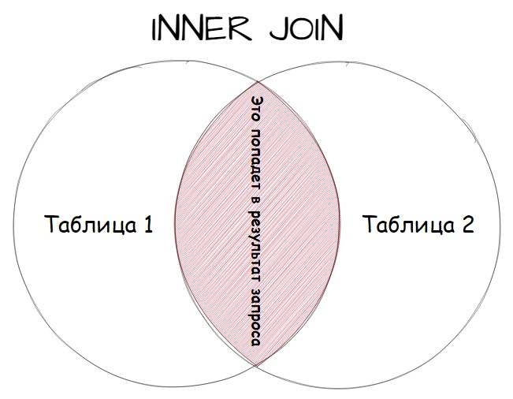
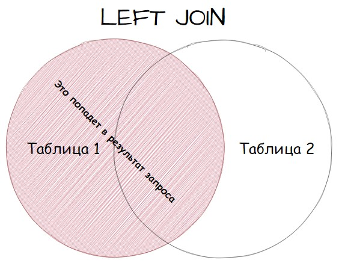
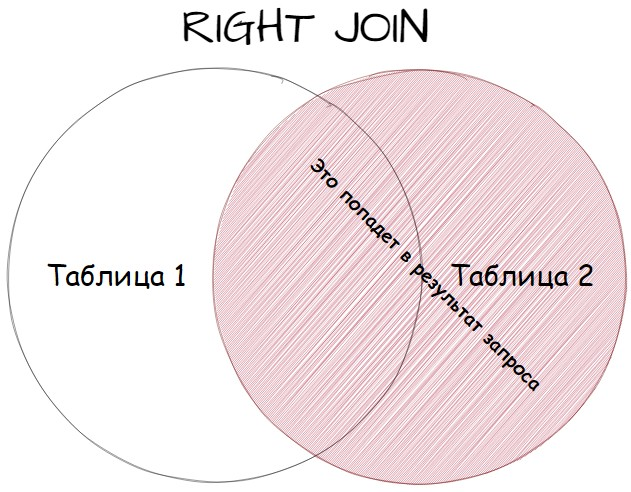
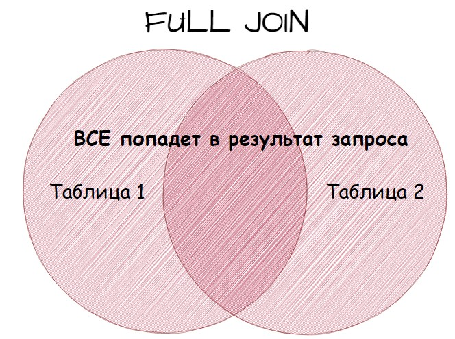
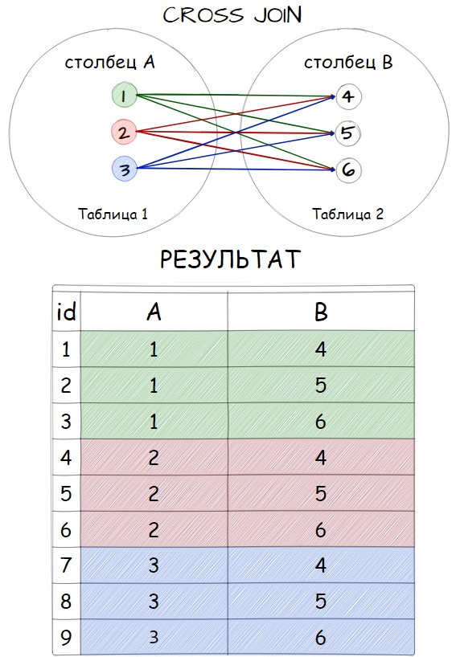

# PostgreSQL

## Типы данных

- `INT` - (integer) целые числа
- `VARCHAR` - (character varying) тип для хранения текстовых строк
- `DECIMAL` - тип данных для записи числовых значений с фиксированной точностью. Для использования этого типа в скобках можно 
указать количество цифр в числе вообще, и  количество знаков 
после точки. К примеру если задать число таким образом `DECIMAL(3,2)`
- `DATE` - тип данных для сохранения дата без временной части. Дату удобно задавать в 
формате YYYY-MM-DD («2024-06-30»).
- `TIMESTAMP` - тип данных хранит дату и время без информации о часовом поясе

## SQL Запросы

### Создание таблицы

Запрос на создание таблицы в общем виде выглядит так:

```sql
CREATE TABLE название_таблицы
(название_столбца1 тип_данных , 
 название_столбца2 тип_данных ,
 .............................
 название_столбцаN тип_данных ,
 атрибуты_таблицы
);
```

Пример создания таблицы:

````sql
CREATE TABLE positions 
(
    id	INT PRIMARY KEY,
    title	VARCHAR,
    salary	INT NOT NULL 
);

CREATE TABLE persons 
(
    id	INT PRIMARY KEY,
    name	VARCHAR,
    position_id	INT,
    FOREIGN KEY (position_id) REFERENCES positions(id)
);
````

#### Первичный ключ

Может быть составным. Определяет уникальность строки.
Для его создания используются ключевые слова `PRIMARY KEY`.

#### Вторичный ключ

Ссылается на первичный ключ связанной таблицы. Для его Для его 
создания используется конструкция 
`FOREIGN KEY (position_id) REFERENCES positions(id)`, где 
`position_id` - столбец внешнего ключа, а `positions(id)` - название таблицы
и название столбца первичного ключа.

### Редактирование таблицы

1. ALTER TABLE: Основная команда для изменения структуры таблицы.
2. ADD COLUMN: Добавление нового столбца в таблицу.
3. DROP COLUMN: Удаление столбца из таблицы.
4. ALTER COLUMN: Изменение типа данных или других свойств столбца.
5. RENAME COLUMN: Переименование столбца.
6. RENAME TO: Переименование таблицы.

####  Примеры запросов

1. Добавление столбца

 ````sql
 ALTER TABLE positions
 ADD COLUMN award VARCHAR(100);
 ````
2. Переименование столбца

````sql
ALTER TABLE positions
RENAME COLUMN award TO bonus;
````

3. Изменение типа данных столбца

````sql
ALTER TABLE positions
ALTER COLUMN bonus TYPE INT USING bonus::INT;
````

4. Переименование таблицы

````sql
ALTER TABLE positions
RENAME TO job_titles;
````

5. Удаление столбца

````sql
ALTER TABLE job_titles
DROP COLUMN bonus;
````


### Добавление записи в таблицу

Пример запроса:

````sql
INSERT INTO positions (id, title, salary) VALUES
	('1', 'Программист', '1500'),
	('2', 'Юрист', '700'),
	('3', 'HR', '700'),
	('4', 'Дизайнер', '700'),
	('5', 'Маркетолог', '500'),
	('6', 'Data Engineer', '3000');

INSERT INTO persons (id, name, position_id) VALUES
    ('1', 'Владимир', '4'),
    ('2', 'Алёна', '1'),
    ('3', 'Евгений', '5'),
    ('4', 'Артём', '2'),
    ('5', 'Борис', '4'),
    ('6', 'Татьяна', '3');
````

Расшифровка `ВСТАВЬ В (таблицу)  positions в столбцы( id, title, salary) ЗНАЧЕНИЯ (...)`

### Обновление записи в таблице

````sql
UPDATE positions
SET title = 'Халтурщик', salary = '50'
WHERE id = 7;
````

### Удаление записи в таблице

````sql
DELETE FROM positions
WHERE id = 7;
````

### Выборка данных (SELECT)

Общий вид:
````sql
SELECT название_столбца1, название_столбца2, название_столбцаN 
FROM название_таблицы;
````

Пример:
````sql
SELECT * 
FROM positions;
````

Чтобы выбрать все столбцы:
````sql
SELECT * 
FROM название_таблицы;
````

#### Фильтрация выборки (WHERE)

````sql
SELECT title
FROM positions
WHERE salary > 1000;
````

##### Операторы сравнения:
- `=` - сравнение на равенство
- `<>` - сравнение на неравенство
- `!=` - сравнение на неравенство
- `<` - меньше чем
- `>` - больше чем
- `<=` - меньше чем или равно
- `>=` - больше чем или равно
- `LIKE` - сравнивает вхождение
- `IN` - проверяет значение в выборке
- `IS NULL` - проверяет на равенство `NULL`

Условие `LIKE` или `NOT LIKE`  позволяет использовать подстановочные символы (метасимволы) в операторе `WHERE`.
Пример:
````sql
SELECT title, salary
FROM positions
WHERE title LIKE '%Data%';
````

#### Уникальные значения (DISTINCT)
`DISTINCT` — это ключевое слово, которое используется для удаления 
дублирующихся строк из результата запроса.

Пример запроса:
````sql
SELECT DISTINCT(salary)
FROM positions;
````

##### Ограничения и особенности:

- `DISTINCT` применяется ко всему результату строки: Когда используется `DISTINCT`, он 
проверяет уникальность всей строки, если указывается несколько столбцов.

- `DISTINCT` и `NULL`: В SQL `NULL` считается уникальным значением, 
поэтому, если в столбце есть несколько NULL значений, DISTINCT оставит только одно.

- Влияние на производительность: Использование `DISTINCT` 
может замедлить выполнение запроса, особенно на больших наборах данных, 
поскольку требуется дополнительная обработка для удаления дублирующихся строк.


#### Алиасы

Для удобства можно использовать псевдонимы.
````sql
SELECT title, salary AS sal
FROM positions
WHERE title LIKE '%Data%';
````

Ключевое слово AS используется для создания псевдонима. В PostgreSQL можно
использовать проблел без `AS`.

#### Агрегатные функции

- `COUNT()` - для нахождения количества строк в запросе.
- `AVG()` - для нахождения среднего значение.
- `SUM()` - для нахождения суммы значений.
- `MIN()` - для нахождения наименьшего значения.
- `MAX()` - для нахождения наибольшего значения.

#### Сортировка и группировка (ORDER BY, GROUP BY)

##### Сортировка

За сотртировку отвечает конструкция `ORDER BY`. Она имеет два значения
- `ASC` - по возрастанию (по умолчанию)
- `DESC` - по убыванию

Пример:
````sql
SELECT * 
FROM positions
ORDER BY salary DESC, title ASC;
````

##### Группировка 

За группировку отвечает конструкция `GROUP BY`.

Пример:
````sql
SELECT product_id, SUM(quantity) AS total_quantity
FROM orders
GROUP BY product_id;

SELECT order_date,product_id, SUM(quantity) AS total_quantity
FROM orders
GROUP BY order_date, product_id
ORDER BY order_date, product_id;
````

###### Оператор HAVING

`HAVING` — это ключевое слово, которое используется вместе с GROUP BY для фильтрации групп строк, основанных на агрегатных функциях. Оно позволяет применять условия к 
группам данных после их агрегации.

`HAVING` аналогично `WHERE`, но применяется после агрегации, тогда как WHERE применяется до нее.

Использование GROUP BY и HAVING:

- `GROUP BY`: Группирует строки по значениям одного или нескольких столбцов.
- `HAVING`: Фильтрует группы, созданные GROUP BY, на основе условий, содержащих агрегатные функции.

Пример:
````sql
SELECT order_date, product_id, SUM(quantity) AS total_quantity
FROM orders
GROUP BY order_date, product_id
HAVING SUM(quantity) > 2
ORDER BY order_date, product_id;
````

#### Подзапросы
Подзапросы - это запросы, которые включены внутри других запросов и могут 
использоваться для извлечения данных, фильтрации, сравнения и других операций.

Возможно использовать с операторами:
- `WHERE`
- `FROM`
- `SELECT`

Примеры:
````sql
SELECT title, salary
FROM positions
WHERE salary IN (SELECT MAX(salary) FROM positions)

SELECT name,email
FROM customers
WHERE (SELECT COUNT(*) FROM orders WHERE orders.customer_id = customers.customer_id) > 5;;
````

Есть еще один сценарий, о существовании которого необходимо знать. 
Это использование подзапросов в операторе FROM. В операторе FROM подзапросы называются встроенными представлениями (view), то есть результатом уже отобранных по какому-то признаку строк.

В этом случае к результатам подзапроса можно обращаться как к 
обычной таблице, но есть одно условие: результату подзапроса обязательно нужно назначить псевдоним. Если не задать псевдоним, то возникнет ошибка. Псевдоним назначается уже привычным способом используя оператор AS.

```sql
SELECT subquery.product_id, subquery.order_date, MAX(subquery.quantity) AS max_quantity_per_day
FROM (SELECT product_id,order_date,quantity FROM orders WHERE product_id = 2) AS subquery
GROUP BY subquery.product_id, subquery.order_date;
```

### UNION и UNION ALL

Операторы UNION и UNION ALL в SQL используются для объединения результатов двух или более SELECT запросов. Различие между 
ними заключается в обработке дубликатов строк.

- `UNION`: Оператор `UNION` объединяет результаты SELECT запросов и удаляет 
дубликаты строк из объединенного результирующего набора.

Пример:
````sql
SELECT column1 FROM table1
UNION
SELECT column1 FROM table2;
````

- `UNION ALL`: Оператор `UNION ALL` также объединяет результаты SELECT запросов, но не удаляет дубликаты строк. Все строки из каждого запроса включаются в объединенный результирующий набор.

````sql
SELECT column1 FROM table1
UNION ALL
SELECT column1 FROM table2;
````

Различия между `UNION` и `UNION ALL`:

- `UNION` удаляет дубликаты строк, а UNION ALL сохраняет все строки включая дубликаты.
- `UNION` выполняет операцию сортировки для удаления дубликатов, что может потребовать дополнительных ресурсов, в то время как UNION ALL не выполняет сортировку.
- `UNION` возвращает уникальный результирующий набор строк, в то время как UNION ALL может содержать дублирующиеся строки

Важно, чтобы в запросах столбцы были одного типа данных.

### JOIN

Различают несколько видов JOIN:

- `INNER JOIN`
- `LEFT/RIGHT JOIN`
- `FULL JOIN`
- `CROSS JOIN`

#### INNER JOIN

`INNER JOIN` возвращают все строки из нескольких таблиц, где выполняется условие соединения.

````sql
SELECT columns
FROM table1
INNER JOIN table2
ON table1.column = table2.column;

ВЫБЕРИ (эти)столбцы
ИЗ таблицы1
СОЕДИНЕННОЙ (с) таблицей2
ПО ПРИНЦИПУ: столбик из таблицы1 = столбик из таблицы 2;
````



Примеры запросов:
````sql
SELECT name, title, salary
FROM persons
INNER JOIN positions
ON persons.position_id = positions.id
````

Если использовать только `JOIN` - по умолчанию это `INNER JOIN`

#### LEFT/RIGHT JOIN

Эти виды JOIN классифицируются как внешние и вот почему. Во внешних соединениях одна из 
используемых таблиц остается в 
своем неизменном виде, а из второй подставляются значения удовлетворяющие условиям.



Примеры:

```sql
SELECT *
FROM positions LEFT JOIN persons
ON positions.id = persons.position_id
```



Какое слово указано вместе с `JOIN`, та таблица и остается полностью в выдаче результатов запроса.

#### FULL JOIN
По сути это LEFT JOIN и RIGHT JOIN выполненные одновременно: присутствуют все строки и из левой и из правой таблицы, там где нет 
соответствия по условию проставлены NULL.



````sql
SELECT *
FROM positions FULL JOIN persons
ON positions.id = persons.position_id
````

#### CROSS JOIN

Концепция `CROSS JOIN` довольно проста. Он создает декартово 
произведение двух таблиц, то есть комбинирует каждую строку из одной 
таблицы с каждой строкой из другой таблицы. Это значит, что каждая 
строка из первой таблицы будет объединена с каждой строкой из второй 
таблицы. `CROSS JOIN` полезен, когда необходимо рассмотреть все возможные 
комбинации двух наборов данных.



````sql
SELECT *
FROM table1 CROSS JOIN table2;
````

## Оптимизация

- Не использовать `*` в `SELECT` запросах
- Ограничение выборки в `SELECT` запрос с помощью оператора `LIMIT`
- Не использовать `DISTINCT` на больших выборках
- При объединениях запросов `UNION ALL` быстрее чем `UNION` за счет отсутствия сортировки


