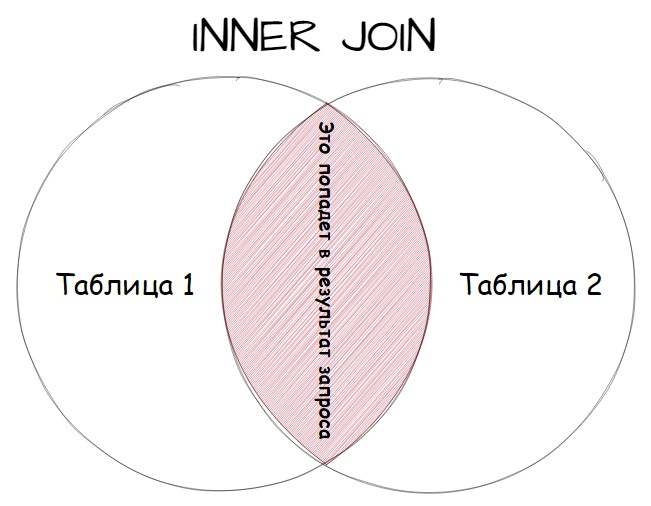
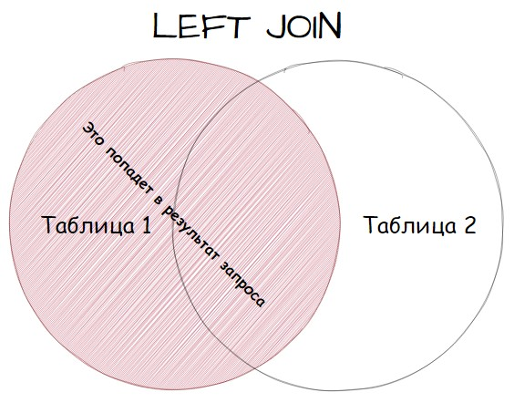
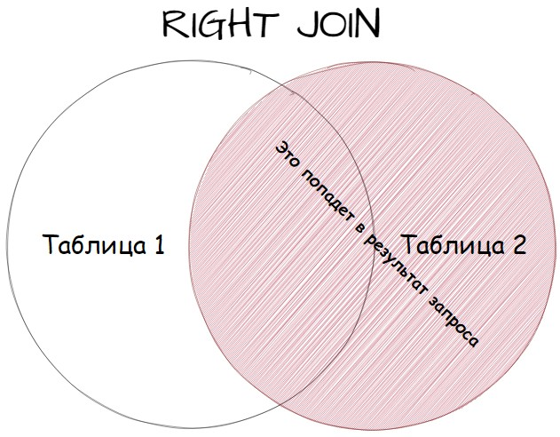
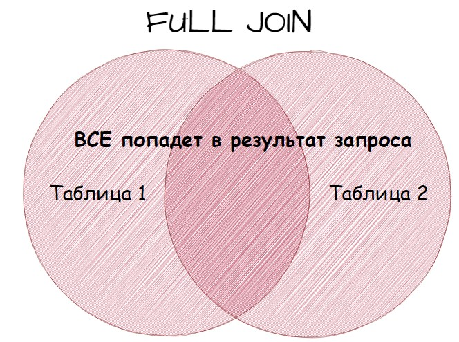

# PostgreSQL

### [Типы данных](data_types.md)

### [DDL](ddl_comands.md)

### [DML](dml_comands.md)

### [Операторы сравнения](diff_operators.md)

### [Полезные функции](functions.md)

### [Функции преобразования типов](functions_type_transformation.md)

### [Оконные функции](window_functions.md)

## SQL Запросы

#### Уникальные значения (DISTINCT)
`DISTINCT` — это ключевое слово, которое используется для удаления 
дублирующихся строк из результата запроса.

Пример запроса:
````sql
SELECT DISTINCT(salary)
FROM positions;
````

##### Ограничения и особенности:

- `DISTINCT` применяется ко всему результату строки: Когда используется `DISTINCT`, он 
проверяет уникальность всей строки, если указывается несколько столбцов.

- `DISTINCT` и `NULL`: В SQL `NULL` считается уникальным значением, 
поэтому, если в столбце есть несколько NULL значений, DISTINCT оставит только одно.

- Влияние на производительность: Использование `DISTINCT` 
может замедлить выполнение запроса, особенно на больших наборах данных, 
поскольку требуется дополнительная обработка для удаления дублирующихся строк.


#### Алиасы

Для удобства можно использовать псевдонимы.
````sql
SELECT title, salary AS sal
FROM positions
WHERE title LIKE '%Data%';
````

Ключевое слово AS используется для создания псевдонима. В PostgreSQL можно
использовать проблел без `AS`.

#### Агрегатные функции

- `COUNT()` - для нахождения количества строк в запросе.
- `AVG()` - для нахождения среднего значение.
- `SUM()` - для нахождения суммы значений.
- `MIN()` - для нахождения наименьшего значения.
- `MAX()` - для нахождения наибольшего значения.

#### Сортировка и группировка (ORDER BY, GROUP BY)

##### Сортировка

За сотртировку отвечает конструкция `ORDER BY`. Она имеет два значения
- `ASC` - по возрастанию (по умолчанию)
- `DESC` - по убыванию

Пример:
````sql
SELECT * 
FROM positions
ORDER BY salary DESC, title ASC;
````

##### Группировка 

За группировку отвечает конструкция `GROUP BY`.

Пример:
````sql
SELECT product_id, SUM(quantity) AS total_quantity
FROM orders
GROUP BY product_id;

SELECT order_date,product_id, SUM(quantity) AS total_quantity
FROM orders
GROUP BY order_date, product_id
ORDER BY order_date, product_id;
````

###### Оператор HAVING

`HAVING` — это ключевое слово, которое используется вместе с GROUP BY для фильтрации групп строк, основанных на агрегатных функциях. Оно позволяет применять условия к 
группам данных после их агрегации.

`HAVING` аналогично `WHERE`, но применяется после агрегации, тогда как WHERE применяется до нее.

Использование GROUP BY и HAVING:

- `GROUP BY`: Группирует строки по значениям одного или нескольких столбцов.
- `HAVING`: Фильтрует группы, созданные GROUP BY, на основе условий, содержащих агрегатные функции.

Пример:
````sql
SELECT order_date, product_id, SUM(quantity) AS total_quantity
FROM orders
GROUP BY order_date, product_id
HAVING SUM(quantity) > 2
ORDER BY order_date, product_id;
````

#### Подзапросы
Подзапросы - это запросы, которые включены внутри других запросов и могут 
использоваться для извлечения данных, фильтрации, сравнения и других операций.

Возможно использовать с операторами:
- `WHERE`
- `FROM`
- `SELECT`

Примеры:
````sql
SELECT title, salary
FROM positions
WHERE salary IN (SELECT MAX(salary) FROM positions)

SELECT name,email
FROM customers
WHERE (SELECT COUNT(*) FROM orders WHERE orders.customer_id = customers.customer_id) > 5;;
````

Есть еще один сценарий, о существовании которого необходимо знать. 
Это использование подзапросов в операторе FROM. В операторе FROM подзапросы называются встроенными представлениями (view), то есть результатом уже отобранных по какому-то признаку строк.

В этом случае к результатам подзапроса можно обращаться как к 
обычной таблице, но есть одно условие: результату подзапроса обязательно нужно назначить псевдоним. Если не задать псевдоним, то возникнет ошибка. Псевдоним назначается уже привычным способом используя оператор AS.

```sql
SELECT subquery.product_id, subquery.order_date, MAX(subquery.quantity) AS max_quantity_per_day
FROM (SELECT product_id,order_date,quantity FROM orders WHERE product_id = 2) AS subquery
GROUP BY subquery.product_id, subquery.order_date;
```

### UNION и UNION ALL

Операторы UNION и UNION ALL в SQL используются для объединения результатов двух или более SELECT запросов. Различие между 
ними заключается в обработке дубликатов строк.

- `UNION`: Оператор `UNION` объединяет результаты SELECT запросов и удаляет 
дубликаты строк из объединенного результирующего набора.

Пример:
````sql
SELECT column1 FROM table1
UNION
SELECT column1 FROM table2;
````

- `UNION ALL`: Оператор `UNION ALL` также объединяет результаты SELECT запросов, но не удаляет дубликаты строк. Все строки из каждого запроса включаются в объединенный результирующий набор.

````sql
SELECT column1 FROM table1
UNION ALL
SELECT column1 FROM table2;
````

Различия между `UNION` и `UNION ALL`:

- `UNION` удаляет дубликаты строк, а UNION ALL сохраняет все строки включая дубликаты.
- `UNION` выполняет операцию сортировки для удаления дубликатов, что может потребовать дополнительных ресурсов, в то время как UNION ALL не выполняет сортировку.
- `UNION` возвращает уникальный результирующий набор строк, в то время как UNION ALL может содержать дублирующиеся строки

Важно, чтобы в запросах столбцы были одного типа данных.

### JOIN

Различают несколько видов JOIN:

- `INNER JOIN`
- `LEFT/RIGHT JOIN`
- `FULL JOIN`
- `CROSS JOIN`

#### INNER JOIN

`INNER JOIN` возвращают все строки из нескольких таблиц, где выполняется условие соединения.

````sql
SELECT columns
FROM table1
INNER JOIN table2
ON table1.column = table2.column;

ВЫБЕРИ (эти)столбцы
ИЗ таблицы1
СОЕДИНЕННОЙ (с) таблицей2
ПО ПРИНЦИПУ: столбик из таблицы1 = столбик из таблицы 2;
````



Примеры запросов:
````sql
SELECT name, title, salary
FROM persons
INNER JOIN positions
ON persons.position_id = positions.id
````

Если использовать только `JOIN` - по умолчанию это `INNER JOIN`

#### LEFT/RIGHT JOIN

Эти виды JOIN классифицируются как внешние и вот почему. Во внешних соединениях одна из 
используемых таблиц остается в 
своем неизменном виде, а из второй подставляются значения удовлетворяющие условиям.



Примеры:

```sql
SELECT *
FROM positions LEFT JOIN persons
ON positions.id = persons.position_id
```



Какое слово указано вместе с `JOIN`, та таблица и остается полностью в выдаче результатов запроса.

#### FULL JOIN
По сути это LEFT JOIN и RIGHT JOIN выполненные одновременно: присутствуют все строки и из левой и из правой таблицы, там где нет 
соответствия по условию проставлены NULL.



````sql
SELECT *
FROM positions FULL JOIN persons
ON positions.id = persons.position_id
````

#### CROSS JOIN

Концепция `CROSS JOIN` довольно проста. Он создает декартово 
произведение двух таблиц, то есть комбинирует каждую строку из одной 
таблицы с каждой строкой из другой таблицы. Это значит, что каждая 
строка из первой таблицы будет объединена с каждой строкой из второй 
таблицы. `CROSS JOIN` полезен, когда необходимо рассмотреть все возможные 
комбинации двух наборов данных.


````sql
SELECT *
FROM table1 CROSS JOIN table2;
````

## Транзакции

**Команды управления транзакциями:**

- `BEGIN` : Начинает новую транзакцию.
- `COMMIT`: Завершает транзакцию и сохраняет все изменения в базе данных.
- `ROLLBACK TO`: Отменяет транзакцию и откатывает все изменения, сделанные в рамках транзакции.
- `SAVEPOINT`: Создает точку сохранения внутри транзакции, к которой можно вернуться с помощью команды `ROLLBACK TO`


```sql
BEGIN;

-- Уменьшаем баланс счета Alice
UPDATE accounts
SET balance = balance - 200.00
WHERE account_id = 1;

-- Увеличиваем баланс счета Bob
UPDATE accounts
SET balance = balance + 200.00
WHERE account_id = 2;

COMMIT;

BEGIN;
UPDATE accounts SET balance = balance - 200.00
    WHERE customer_name = 'Alice';
SAVEPOINT my_savepoint;
UPDATE accounts SET balance = balance + 200.00
    WHERE customer_name = 'Bob';
-- ошибочное действие... забыть его и использовать счёт Чарли
ROLLBACK TO my_savepoint;
UPDATE accounts SET balance = balance + 200.00
    WHERE customer_name = 'Charlie';
COMMIT;
```

Основные виды феноменов в транзакциях:

- Грязное чтение (Dirty Read): Одна транзакция видит изменения, сделанные другой транзакцией, которые еще не были зафиксированы (committed). Это может привести к чтению данных, которые могут быть отменены (rolled back).

- Неповторяющееся чтение (Non-repeatable Read): Одна транзакция читает данные дважды и получает разные результаты, потому что другая транзакция изменила данные между этими чтениями.

- Фантомное чтение (Phantom Read): Одна транзакция выполняет повторную выборку набора строк по одному и тому же критерию и получает разные результаты, потому что другая транзакция добавила или удалила строки, соответствующие этому критерию.

- Аномалия сериализации (Serialization Anomaly): Результат успешной фиксации группы параллельно выполняющихся транзакций не совпадает с результатом ни одного из возможных вариантов последовательного выполнения этих транзакций.

- Потерянное обновление (Lost Update): Две транзакции читают одно и то же значение, затем обе транзакции пытаются обновить это значение на основе прочитанного значения. В результате одна из транзакций может перезаписать изменения другой транзакции, что приводит к потере обновлений.

Основные уровни изолированности транзакций:


### Установка уровня изолированности для текущей транзакции

```sql
BEGIN;
SET TRANSACTION ISOLATION LEVEL REPEATABLE READ;

-- Ваши SQL-запросы здесь

COMMIT;
```

### Установка уровня изолированности для всех транзакций в сессии

```sql
SET SESSION CHARACTERISTICS AS TRANSACTION ISOLATION LEVEL REPEATABLE READ;

-- Ваши SQL-запросы здесь
```

### Установка уровня изолированности по умолчанию для всех сессий

Вы можете установить уровень изолированности по умолчанию для всех сессий, изменив параметр конфигурации default_transaction_isolation в файле конфигурации PostgreSQL (postgresql.conf).

```
default_transaction_isolation = 'repeatable read'
```

## Индексы

## Оптимизация

- Не использовать `*` в `SELECT` запросах
- Ограничение выборки в `SELECT` запрос с помощью оператора `LIMIT`
- Не использовать `DISTINCT` на больших выборках
- При объединениях запросов `UNION ALL` быстрее чем `UNION` за счет отсутствия сортировки

## Полезные приемы

### Подсчет количества уникальных элементов

````sql
COUNT(DISTINCT(название_столбца))
````

## Работа с датами

### Разница между датами

```sql
SELECT town_to, TIMEDIFF(time_in, time_out) as flight_time
FROM Trip
WHERE town_from = "Paris";
```

### Промежуток между датами


