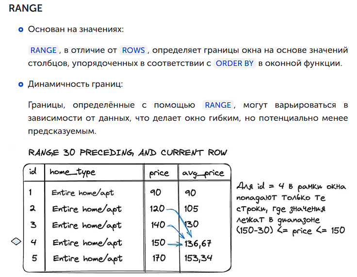

## Оконные функции

Оконные функции (window functions) в SQL - это мощный инструмент
анализа данных, который позволяет выполнять вычисления на наборе
строк, связанных с текущей строкой. Они представляют собой специальный
класс функций, которые могут быть применены к набору строк, но без необходимости
группировки строк как в случае с агрегатными функциями.

Оконные функции обычно используются для вычисления кумулятивных сумм,
расчета разницы между текущей строкой и предыдущей, определения ранга
элемента в упорядоченном наборе данных и других аналитических задач.

**Основные аспекты оконных функций:**
- `Сохранение всех строк`: В отличие от агрегатных функций, которые группируют строки и возвращают одну строку на группу, оконные функции возвращают значение для каждой строки исходного набора данных.
- `Часть результата`: Оконные функции используют ключевое слово `OVER`, чтобы указать набор строк, на которые они будут применяться.
- `Разделение и упорядочение`: Вы можете разделить строки на группы (разделы) и упорядочить их внутри этих групп с помощью ключевых слов `PARTITION BY` и `ORDER BY`.

**Типы оконных функций:**
- Агрегатные оконные функции
- Функции ранжирования
- Функции смещения

**Оконную функцию можно использовать без `(PARTITION BY столбец)` - в таком случае окном будет вся таблица**

### Синтаксис

```sql
SELECT <оконная_функция>(<поле_таблицы>)
OVER (
      [PARTITION BY <столбцы_для_разделения>]
      [ORDER BY <столбцы_для_сортировки>]
      [ROWS|RANGE <определение_диапазона_строк>]
)
```

Где:
- <оконная_функция>(<поле_таблицы>) — используемая оконная функция. Например AVG(price).
- Далее следует OVER, который определяет окно (группу строк), которое будет передаваться в оконную функцию. Если конструкцию OVER () оставить без параметров, то окном будет выступать вся таблица.

Далее внутри OVER следуют 3 необязательных параметра, с помощью которых можно гибко настраивать окно:

- с помощью PARTITION BY <столбцы_для_разделения> выборка делится на непересекающиеся подмножества, где каждое подмножество содержит строки с одинаковыми значениями в одном или нескольких столбцах, образуются партиции.
- с помощью ORDER BY <столбцы_для_сортировки> устанавливается порядок строк внутри окна, особо важную роль играет в оконных функциях ранжирования.
- с помощью ROWS|RANGE <определение_диапазона_строк> формируются диапазоны строк. С помощью этого параметра можно указать сколько строк брать до и после текущей в окно.

````sql
SELECT
    Student.first_name,
    Student.last_name,
    Student_in_class.class,
    COUNT(*) OVER (PARTITION BY Student_in_class.class) AS student_count_in_class
FROM
    Student_in_class
JOIN
    Student ON Student_in_class.student = Student.id;
````

`Выражение PARTITION BY Student_in_class.class разделяет все строки таблицы на партиции по полю class. 
Так, для каждой из строк в оконную функцию будут подаваться только те строки таблицы, где поле class 
совпадает с полем class в текущей строке.
Функция COUNT же возвращает количество переданных в неё строк, тем самым мы и получаем сколько учащихся 
учится в каждом из классов.`


### Порядок выполнения


### Партиции
`Партиции — подмножества строк, выделенные для оконной функции на основе одного или нескольких столбцов в таблице.`

Они служат для сегментации данных, позволяя выполнить более детальный анализ и расчёты вроде агрегации или ранжирования внутри каждой такой группы.

Применяя партиционирование, например, по типу жилья в таблице с данными о цене жилья, мы можем рассчитать в отдельной колонке, скажем, среднюю цену для каждого типа жилья.


#### Партиции по нескольким колонкам

````sql
SELECT
    home_type, has_tv, price,
    AVG(price) OVER (PARTITION BY home_type, has_tv) AS avg_price
    FROM Rooms
````


### Сортировка

Сортировка определяет в каком порядке будет расширяться сегмент внутри окна.

Запрос без сортировки
````sql
SELECT user_id,
       start_date,
       total AS reservation_price,
       SUM(total) OVER (
            PARTITION BY user_id
       ) AS total_expenses
FROM Reservations;
````


поле `total_expenses` определяется на основании всего окна

Запрос с сортировкой
````sql
SELECT user_id,
       start_date,
       total AS reservation_price,
       SUM(total) OVER (
           PARTITION BY user_id
           ORDER BY start_date
           ) AS cumulative_total
FROM Reservations;
````


поле `total_expenses` определяется на основании текущий строки и предыдущей по порядку сортировки

**Эффект накапливания срабатывает, если не указывать ROWS|RANGE**

````sql
SELECT <оконная_функция>(<поле_таблицы>)
OVER (
      [PARTITION BY <столбцы_для_разделения>]
      [ORDER BY <столбцы_для_сортировки>]
      [ROWS|RANGE <определение_диапазона_строк>]
)
````

Он позволяет указать рамки окна относительно текущей строки, которые будут использоваться для вычисления в оконной функции.

Так, можно указать, чтобы при рассчитывании значений для текущей строки в оконную функцию отправились не все записи в рамках текущей партиции, а только N записей до текущей строки и N после.

При использовании ORDER BY, если в блоке ROWS|RANGE ничего не указано, то в оконной функции автоматически применяется правило RANGE BETWEEN UNBOUNDED PRECEDING AND CURRENT ROW. Это означает, что окно будет начинаться с первой строки и заканчиваться текущей строкой.

То есть значения для колонки cumulative_total будут высчитываться следующим образом:


### Рамки окон
Партиция (PARTITION BY). Это деление всего набора результатов на непересекающиеся подмножества, 
где каждое подмножество содержит строки с одинаковыми значениями в одном или нескольких столбцах. Оконные функции 
применяются отдельно к каждой партиции, как если бы каждая из них была отдельным набором данных.

Окно. Определяет, какие конкретные строки в каждой партиции будут использоваться для вычисления оконной функции для каждой строки. Окно может изменяться от строки к строке.

Например, если используется правило ROWS BETWEEN 1 PRECEDING AND CURRENT ROW, то 
для каждой строки окно будет состоять из неё самой и 
одной предшествующей строки. Это как "подпартиция" внутри уже существующей партиции.


#### Определение границ
````sql
SELECT <оконная_функция>(<поле_таблицы>)
OVER (
      ...
      ROWS|RANGE BETWEEN <начало границы окна> AND <конец границы окна>
)
````

**Возможные определения границ окна**
- `UNBOUNDED PRECEDING`, все строки, предшествующие текущей
- `N PRECEDING`, N строк до текущей строки
- `CURRENT ROW`, текущая строка
- `N FOLLOWING`, N строк после текущей строки
- `UNBOUNDED FOLLOWING`, все последующие строки


#### Отличия ROWS от RANGE




### Функции


#### Агрегатные оконные функции

Эти функции выполняют агрегатные вычисления, но в отличие от обычных агрегатных функций, они не группируют строки, а возвращают значение для каждой строки.
Например:
````sql
SELECT order_id, order_date, quantity,
       SUM(quantity) OVER (PARTITION BY order_date) AS daily_total_quantity
FROM orders;
````

В этом запросе окно определяется следующими частями:

`OVER (PARTITION BY order_date)`: Это и есть окно. Оно определяет набор строк, к которому применяется агрегатная функция SUM(). В данном случае строки разбиваются на
группы (partitions) по значению столбца order_date.

`PARTITION BY order_date` разбивает набор строк на поднаборы, где каждая подгруппа содержит строки с одинаковым значением order_date. В каждой подгруппе вычисляется сумма quantity,
и это значение присваивается каждой строке в этой подгруппе.


Отличия от агрегатных функций:


````sql
SELECT order_id, order_date, quantity,
       AVG(quantity) OVER (PARTITION BY order_date) AS daily_avg_quantity
FROM orders;

SELECT order_id, order_date, quantity,
       MIN(quantity) OVER (PARTITION BY order_date) AS daily_min_quantity
FROM orders;
````

#### Функции ранжирования

Эти функции назначают ранг или позицию строкам в пределах окна.
`ROW_NUMBER()`: Назначает уникальный номер каждой строке в пределах окна.

````sql
SELECT order_id, order_date, quantity,
       ROW_NUMBER() OVER (PARTITION BY order_date ORDER BY quantity DESC) AS row_num
FROM orders;
````


`RANK()`: Назначает ранг строкам с возможностью дубликатов (одинаковые значения получают одинаковый ранг, а следующая строка получает ранг с пропуском).

````sql
SELECT order_id, order_date, quantity,
       RANK() OVER (PARTITION BY order_date ORDER BY quantity DESC) AS rank
FROM orders;

SELECT 
    order_id,
    RANK() OVER (ORDER BY quantity * products.price_per_unit DESC) AS order_rank
FROM orders
    INNER JOIN products USING(product_id);
````


Оранжевая партицию: тут 2 максимальных значения quantity имеют rank = 1, а следующее
по порядку значение quantity имеет значение rank не 2, а 3, потому как первых значений
2 строки, и значение rank = 2 - пропускается.

`DENSE_RANK()`: Назначает ранг строкам без пропусков (одинаковые значения получают одинаковый ранг,
следующая строка получает следующий ранг без пропуска).

````sql
SELECT order_id, order_date, quantity,
       DENSE_RANK() OVER (PARTITION BY order_date ORDER BY quantity DESC) AS dense_rank
FROM orders;
````


`NTILE()`: Разбивает строки на n примерно равных частей и назначает номер каждой части.

````sql
SELECT order_id, order_date, quantity,
       NTILE(4) OVER (ORDER BY order_date) AS quartile
FROM orders;
````

#### Функции смещения

Эти функции позволяют получать значения из соседних строк.

`LAG()`: Возвращает значение из предыдущей строки в пределах окна.
Параметры функции указываются в скобках (столбец и шаг смещения).

````sql
SELECT order_id, order_date, quantity,
       LAG(quantity, 1) OVER (ORDER BY order_date) AS prev_quantity
FROM orders;
````


`LEAD()`: Возвращает значение из следующей строки в пределах окна.

````sql
SELECT order_id, order_date, quantity,
       LEAD(quantity, 1) OVER (ORDER BY order_date) AS next_quantity
FROM orders;
````


`FIRST_VALUE()`: Возвращает первое значение в пределах окна.

````sql
SELECT order_id, order_date, quantity,
       FIRST_VALUE(quantity) OVER (PARTITION BY order_date) AS first_quantity
FROM orders;
````


`LAST_VALUE()`: Возвращает последнее значение в пределах окна.

````sql
SELECT order_id, order_date, quantity,
       LAST_VALUE(quantity) OVER (PARTITION BY order_date) AS last_quantity
FROM orders;
````

**Важное замечание:** Для `LAG` и `LEAD` обязательно использование `ORDER BY`, так как они
зависят от порядка строк. Для `LAST_VALUE` и `FIRST_VALUE` обязательно использование
`PARTITION BY`, чтобы определить группы строк в которых собственно и ищем последнее
и первое значение.

#### Функции, работающие с рамками (frames)

Эти функции позволяют задавать рамку (frame) внутри окна, на которую будет распространяться
вычисление. Ключевые слова `ROWS` и `RANGE` помогают определить рамку.

`ROWS BETWEEN`: Устанавливает рамку на основе числа строк относительно текущей строки.
````sql
SELECT order_id, order_date, quantity,
       SUM(quantity) OVER (ORDER BY order_date ROWS BETWEEN 1 PRECEDING AND 1 FOLLOWING) AS sum_around
FROM orders;
````

`RANGE BETWEEN`: Устанавливает рамку на основе значений в строках относительно текущей строки.
````sql
SELECT order_id, order_date, quantity,
       SUM(quantity) OVER (ORDER BY order_date RANGE BETWEEN INTERVAL '1 DAY' PRECEDING AND CURRENT ROW) AS range_sum
FROM orders;
````

### Ограничения оконных функций

- С оконными функциями `DISTINCT` не сработает.
- Нельзя сочетать оконные функции с группировкой.
- Оконные функции, как и агрегирующие функции, нельзя использовать в условиях после WHERE.